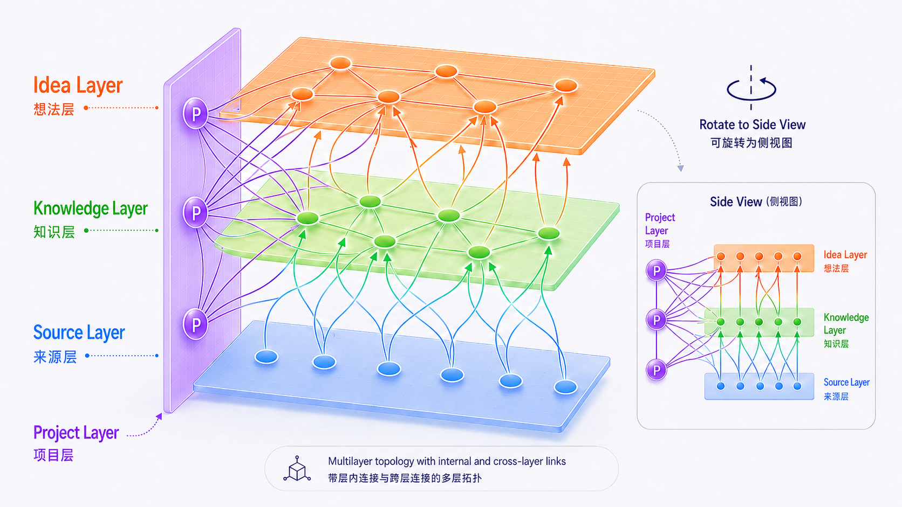

# SKIP Topology

Source-Knowledge-Idea-Project Topology is a local-first prototype for tracing how source material becomes reusable knowledge, how knowledge produces ideas, how ideas enter projects, and how projects generate new source material.



SKIP is not a general Obsidian backlink graph. It is a constrained topology for following knowledge development through a directed loop:

```text
Source -> Knowledge -> Idea
Knowledge -> Project
Idea -> Project
Project -> Source
```

## Quick Start

```bash
npm install
npm run export:graph
npm run dev
```

The viewer reads `public/graph.json`, which is generated from frontmatter in `vault/`.

## Core Model

- **Source**: raw traceable input such as conversations, papers, articles, meeting notes, project logs, code outputs, and experiment records.
- **Knowledge**: reusable concepts, methods, frameworks, principles, definitions, models, and patterns extracted from sources.
- **Idea**: generative hypotheses, project ideas, design concepts, research questions, product concepts, and prototype directions.
- **Project**: execution layer that consumes knowledge and ideas, then produces new source material.

The `Project -> Source` edge closes the loop: execution produces new traceable material.

## Legal Edges

The exporter intentionally supports only five main edge types:

- `source_to_knowledge`
- `knowledge_to_idea`
- `knowledge_to_project`
- `idea_to_project`
- `project_to_source`

Relationships are read from Markdown frontmatter only. Body wikilinks are ignored in v1 so the graph stays semantic and auditable.

## Viewer

The MVP viewer provides:

- Global View across Source, Knowledge, Idea, and Project layers
- Project Focus for `Knowledge -> Project <- Idea` plus `Project -> Source`
- node detail panel with status, tags, path, next action, and lineage
- fixed 3D layer placement with a left-side Project layer
- dotted halo treatment for newly generated Source nodes

## Scripts

- `npm run export:graph`: parse the sample vault and write `public/graph.json`
- `npm run dev`: run the Vite 3D viewer
- `npm run build`: type-check and build the viewer
- `npm run test`: run exporter and layout tests

## Roadmap

- Layer Focus mode for inspecting one layer and its direct context
- Lineage View for tracing `Source -> Knowledge -> Idea -> Project -> Source`
- richer Obsidian vault authoring helpers
- Obsidian plugin integration with a custom SKIP Topology view
